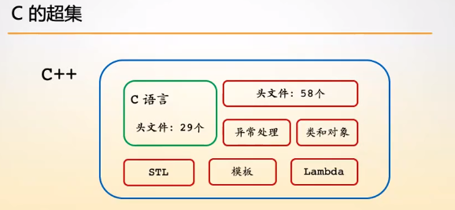

# 从C到C++

C++是C语言的超集。

C++支持的编程范式比C语言多，有：

+ 面向过程编程
+ 面向对象编程
+ 泛型编程: **去掉了类型限定，将过程中的类型进行泛化，模板支持。**
+ 函数式编程: lambda表达式支持。

**根据编程范式学习，C++的语言特性。明白编程范式的应用场合。**关注C++程序内部的执行流程。

编程范式规定了我们如何去写程序。

**提高开发效率：**

+ **代码开发**
+ **测试**
+ **维护**

面向对象，泛型编程就是用于提高开发效率的。

**语言学习的重点就是根据不同的编程范式去学习语法特性。**

**在C++中继承的是C的语法，而不是底层实现，例如，在C++中的struct实际上就是类。**