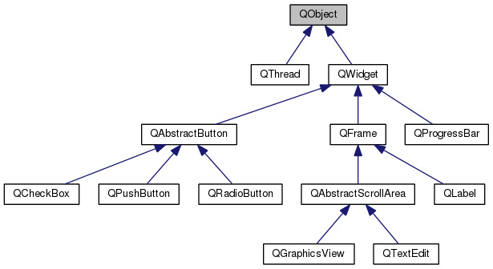

# Qt学习笔记

Qt中的一些常用模块集合：`QtCore,QtGui,QtWidgets`等。

## 一、建立Qt应用

```c++
#include <QApplication>
#include <QPushButton>

int main(int argc, char **argv) {
 QApplication app (argc, argv);

 QPushButton button ("Hello world !");
 button.show();

 return app.exec();
}
```


## 二、Qt类继承关系



`QObject`是Qt中最基础的类，当然，目前我需要做的项目主要使用的是`QWidget`及其子类，用于设计GUI布局。

此外，`QObject`提供了一些重要的机制：

+ **对象名称 (object name)**：可以给一个对象设置名字，方便查找对象。
+ **parenting system**：保证一个类的对象释放时，其内部的其他类型的对象能够被一并释放，（与析构不是一个概念）。
+ **signals and slots**：信号与槽机制，**信号与槽都是函数（可调用对象），并且最好两者的参数类型一致，通过connect()连接控件之间的信号与槽，在一些方法中，使用`emit signal_function(args)`就可以发出信号**。
+ **event management**。


## 三、Parenting System

保证一个类的对象释放时，其内部的其他类型的对象能够被一并释放，哪怕是指针也会进一步释放，不需要使用析构函数（与析构不是一个概念）。


## 四、Signal and Slot

> + signal：是一个object能够发送的信息，多数时候是通知状态的变化，而signal本质上还是函数（可调用对象）。
> + slot：是一个用于接收并对signal进行反馈的函数（可调用对象）。

Qt中的控件有预先定义好的一些Signal，如`Button的clicked, pressed, released`等等，也有很多预定义好的slot，如`QApplication::quit, QWidget::setEnabled, QPushButton::setText`等。

在Qt中，**使用`QObject::connect()`函数绑定控件之间的signal和slot**：

```c++
QObject::connect(sender, SIGNAL(func_1(types)), receiver, SLOT(func_2(types)));
// 如：
QObject::connect(manager, SIGNAL (tick(int)), progress, SLOT (setValue(int)));
```

> + A signal can be connected to several slots
> + Many signals can be connected to a slot
> + a signal can be connected to a signal: **Signal Relaying, call `emit signal_function(args)` to send a signal**.


## 五、创建自定义的signal和slot

要创建自定义的signal和slot，需要使用Qt的**meta-object system**。具体的使用就是在类中指定`Q_OBJECT`。

```c++
class MyWidget : public QWidget {
     Q_OBJECT
     public:
      	MyWidget(QWidget *parent = 0);
}
```

### 1.  创建自定义signal

首先，需要在类中增加 `Q_OBJECT`的宏，然后在`public / private signal:`中声明signal，之后实现即可。

### 2. 创建自定义slot

首先，需要在类中增加`Q_OBJECT`的宏，然后在`slot:`中声明slot，之后实现即可。

### 3. 发出signal (emit signal)

很多时候我们需要发出指定的signal，这就需要使用`emit`来发送出signal，因为控件的signal和slot往往是针对交互的，而用户自定义的signal和slot是为了处理一些业务细节的，有时候会在`slot`中`emit signal_func(args)`，有时会在其他`signal`中`emit signal_func(args)`。

> 当然，要保证signal和slot之间是connect的。

```c++
class Window : public QWidget {
 	Q_OBJECT
    public:
         explicit Window(QWidget *parent = 0);
        signals:
         void counterReached();
        private slots:
         void slotButtonClicked(bool checked);
        private:
         int m_counter;
         QPushButton *m_button;
};

Window::Window(QWidget *parent) : QWidget(parent) {
     // Set size of the window
     setFixedSize(100, 50);

    // Create and position the button
     m_button = new QPushButton("Hello World", this);
     m_button->setGeometry(10, 10, 80, 30);
     m_button->setCheckable(true);

     m_counter = 0;

    connect(m_button, SIGNAL (clicked(bool)), this, SLOT (slotButtonClicked(bool)));
     connect(this, SIGNAL (counterReached()), QApplication::instance(), SLOT (quit()));
}

void Window::slotButtonClicked(bool checked) {
    if (checked) {
        m_button->setText("Checked");
    } else {
        m_button->setText("Hello World");
    }

	m_counter ++;
	if (m_counter == 10) {
		emit counterReached();
 	}
}
```

