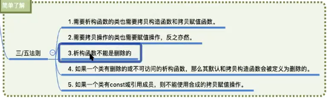

# 构造与析构的三五法则



## 1.法则1：需要析构函数的类也需要拷贝构造函数和拷贝赋值函数

真正需要析构函数的类是申请了额外存储空间的类，需要在析构函数中释放。

而申请了额外空间之后，这个类需要的就必须是深拷贝，因此，需要拷贝构造函数和拷贝赋值函数。


## 2.法则2：需要拷贝操作的也需要赋值操作，反之亦然

这两个就是绑定在一起的。


## 3.法则3：析构函数不能是删除的

析构函数如果是删除的，那么比如局部变量需要销毁时要调用析构函数，而析构函数被删除了，**就会造成我们无法定义对象**。

**虽然我们可以自己申请空间存，但是我们无法使用delete删除，因为delete本质上是调用了析构函数的。**


## 4.法则4：如果一个类有删除的或不可访问的析构函数，那么其默认和拷贝赋值操作函数会被定义为删除的


## 5.法则5：如果一个类有const类型变量或者引用，那么就不能使用合成的赋值拷贝操作

这是因为const类型的变量不能被改变值。

**==在构造函数进入大括号中时，对象(包括对象的成员属性)的构造行为已经结束了，我们在大括号里总写的是一些逻辑代码==。**

我们可以自己在大括号之前的初始化列表里显式表示对一些变量的构造，**==凡是可以在初始化列表里初始化的行为就绝对不要放到大括号中。==**

举例如下：

```c++
A(int x, int y) : x(x), y(y), z(8) {}
// ：之后，{之前的这一个部分就是初始化列表
```


**而引用是需要在定义的时候，立即绑定一个对象/变量，因为引用就是一个对象/变量的别名，因此，如果要使用引用，那么就需要在初始化列表里显式进行初始化。**


**==构造函数的初始化列表才是一个对象的成员属性进行初始化的阶段，而不是在构造函数的大括号中的逻辑。==**