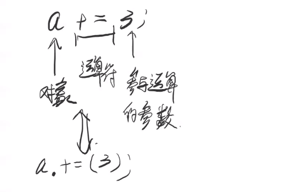

# 运算符重载

作业：

1. 学习5种STL容器，整理其重载的运算符。
2. 在haizei命名空间中实现一个string类。


> **==cin, cout实际上是对象，负责输入输出操作，通过运算符重载使得可以使用左移，右移运算符来执行输入、输出操作。==**
>
> cin实际上是`istream`类型，cout实际上是`ostream`类型

**重载运算符的一个规则：==重载运算符不可以改变传入参数的个数，也不可以改变运算符的优先级。==**


**只能在类内重载的4类运算符：**

+ 小括号()：**函数对象**
+ 中括号[]：**数组对象**
+ 间接引用->：**指针对象**
+ 赋值运算符=

**另外，5类不可以重载的运算符：**

+ 直接引用 . 运算符(a.x)
+ .\*运算符(函数指针成员运算符a.\*x)
+ 三目运算符(? : 表达式)
+ 域作用运算符(haizei::cin中的 ::)
+ sizeof()运算符

> 因为程序底层是没有类型的，这个是必须依赖sizeof()运算符的，不可修改，同理，直接引用.等不能重载，否则会破坏C++语言的体系。

此外，对于运算符的理解：



**任何运算，只要前面是对象，中间是运算符，后面是参与运算的参数的话，在C++中，就可以认为这个就是调用了C++类里的成员方法，而这就是==类内重载运算符(将运算符重载为类内的成员方法)==的应用场景，此时通常只需要传入一个参数(如果是2目运算符)。**

**此外还有类外重载，面对一个二元运算符重载，只需要定义一个两个参数的函数的即可。**

**==C++中没有新增运算符，而是通过重载运算符来扩充程序的功能，简化程序的表达过程。==**


## 一、类内重载运算符

运算符可以在类内重载运算符，这种重载运算符优先级最高，即运算符最先匹配的是类内的重载运算符。

此外，运算符也可以在类外重载，只要能让调用处的代码找得见就行。

**千万要注意：==类内重载运算符时，参数个数一定要少一个，对象本身就是运算符计算的参数的一部分！！！==**

**==当我们返回引用的时候，一定要注意返回的引用绑定的对象的生存周期。==**

```c++
class ostream {
    public:
	// 类内重载，n目运算符的话，参数只需要n-1个，因为对象本身就是一个参与运算的变量
    ostream &operator<<(int &n) {
        std::cout << n;
        return *this;
    }

    ostream &operator<<(const char *msg) {
        std::cout << msg;
        return *this;
    }

    private:
};

// 类外重载，因为左移运算符是二目运算符，所以重载运算符需要两个参数，几目运算符就需要几个参数
haizei::ostream &operator<<(haizei::ostream &out, double &z) {
    std::cout << z;
    return out;
}
```


## 二、重载运算符的返回值分析

**我们可以随意设置重载运算符的返回值，因为重载运算符实际上就是一个函数。**

以cin和cout为例，**==为了能够实现连续输入，连续输出，就要求重载运算符的返回值应当是cin，cout对应类型的返回值，同时我们为了保证使用的是同一个cin，cout，所以cin，cout返回值就应该是引用。==**

```c++
#include<iostream>
#include<string>
#include<vector>
#include<queue>
#include<stack>
#include<algorithm>

namespace haizei {
    class istream {
    public:
        // 设置返回值类型，为了能够实现连续读，返回的应当还是istream类型的，同时这里应当使用的是同一个cin，那么返回值就应当是当前istream对象的引用，即*this，ostream同理。
        // 对于部分参数，我们应当尽量使用引用，输入的话，就必须是引用，因为最终的输入是必须要输入到对应的变量中的，其他情况下使用引用就是为了减少不必要的拷贝操作，提高速度。
        istream &operator>>(int &n) {
            std::cin >> n;
            return *this;
        }

    private:
    };

    class ostream {
    public:
        ostream &operator<<(int &n) {
            std::cout << n;
            return *this;
        }
        // const char *msg 对于字符串字面量的处理
        ostream &operator<<(const char *msg) {
            std::cout << msg;
            return *this;
        }

    private:
    };

    istream cin;
    ostream cout;
};

int main() {
    int n, m;
    // 考虑到重载运算符的返回值，处理完haizei::cin >> n, 等于haizei::cin>>(int n)，返回值是haizei::cin，继续处理haizei::cin >> m，再重载运算符，循环往复。
    haizei::cin >> n >> m;
    haizei::cout << n << " " << m << "\n";
    return 0;
}
```


## 三、一个标准的运算符重载的例子

```c++
#include<iostream>
#include<string>
#include<vector>
#include<queue>
#include<stack>
#include<algorithm>
using namespace std;

class Point {
public:
    Point() : __x(0), __y(0) {}
    Point(int x, int y) : __x(x), __y(y) {}
    int x() const { return this->__x; }
    int y() const { return this->__y; }

    Point operator+(const Point &a) {
        return Point(this->__x + a.x(), this->__y + a.y());
    }

    Point &operator+=(const Point &a) {
        this->__x += a.x();
        this->__y += a.y();
        return *this;
    }

    // 类内重载运算符，当前对象本身就是一个运算符的参数
    Point &operator++() {
        this->__x += 1;
        this->__y += 1;
        return *this;
    }

    // 传入int仅仅是为了区分前后++
    // pass int just to distinguish pre++, and later++
    Point operator++(int) {
        Point temp(*this);
        this->__x += 1;
        this->__y += 1;
        return temp;
    }

private:
    int __x, __y;
};

// 类外运算符重载
ostream &operator<<(ostream &out, const Point &a) {
    cout << "Point (" << a.x() << ", " << a.y() << ")";
    return out;
}

int main() {
    Point a(4, 5), b(3, 4), c(1, 1);
    cout << a << endl;
    cout << b << endl;
    cout << c << endl;
    cout << a + b << endl;
    c += b;
    cout << c << endl;
    cout << ++(c += b) << endl;
    cout << c++ << endl;
    cout << c << endl;
    return 0;
}
```


## 四、关于函数对象与数组对象的实现

函数对象实际上就是通过重载小括号运算符，其对象的表现就会很像函数，因此称之为函数对象。

由于中括号[]也可以重载运算符，**这就是 函数是压缩的数组，数组是展开的函数。** 由于重载运算符之后参数可以任意类型的，所以这里也可以称之为映射对象。


## 五、重载`->`,`*`运算符(智能指针的实现原理基础知识)

对于**指针对象**，例如常说的智能指针，这就要求需要重载例如`->`,`*`运算符。

```c++
#include<iostream>
#include<string>
#include<vector>
#include<queue>
#include<stack>
#include<algorithm>
using namespace std;

class A {
public:
    int x, y;
};

class B {
public:
    B() : obj(nullptr) {
        arr = new int[10];
        arr[3] = 9973;
    }

    B(A *obj) : B() {
        this->obj = obj;
    }

    int operator()(int a, int b) {
        return a + b;
    }

    int &operator[](int ind) {
        return this->arr[ind];
    }

    void operator[](const char *msg) {
        cout << msg << endl;
        return ;
    }

    A *operator->() {
        return this->obj;
    }

    // 返回引用！！！
    A &operator*() {
        return *this->obj;
    }
    
    ~B() {
        delete arr;
    }

private:
    int *arr;
    A *obj;
};

ostream &operator<<(ostream &out, A &a) {
    out << "A(" << a.x << ", " << a.y << ")" << endl;
    return out;
}

int main() {
    B add;
    cout << add(3, 4) << endl;
    cout << add[3] << endl;
    add[3] = 8876;
    cout << add[3] << endl;
    add["hello world"];
    A a;
    B p = &a;
    a.x = 67, a.y = 99;
    cout << p->x << " " << p->y << endl;
    cout << *p << endl;
    return 0;
}
```

