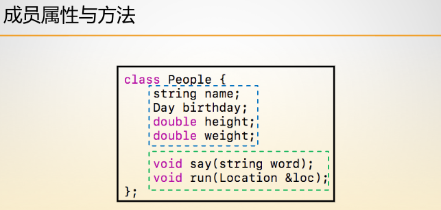
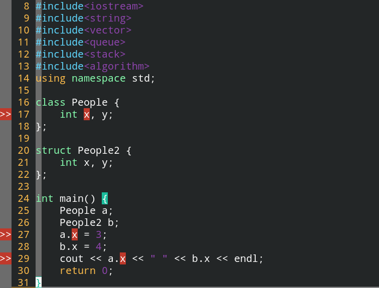

# C++ 类和对象

## 一、类型与变量

类型 = 类型数据 + 类型操作。


## 二、类与对象

在C++中，类型与变量的关系就是类与对象的关系，类实际上就是更加复杂的类型。

类型实际上就是在进行数据的表示与数据的存储，而这个是和数据结构的概念是一致的，因此类的概念也是和数据结构的概念是一致的。

**类实际上就是一组事物的抽象。**


## 三、成员属性与方法

属性就是数据，方法就是操作。下面就是类的声明：




## 四、访问权限

| 访问权限  | 说明                                                     |
| --------- | -------------------------------------------------------- |
| public    | 公共访问权限，在类外也可以访问与使用                     |
| private   | 私有访问权限，只能在类里访问与使用                       |
| protected | 受保护的访问权限，只有在继承中涉及到，即只有子类可以使用 |

而friendly是友元方法，即可以访问类内部的私有属性与方法，**但是友元函数还是属于外部的。**

**使用访问权限可以使得运行时的BUG变成编译时的BUG，提早去除隐患，这是程序设计与编码的规范。**



在C++中，class的属性默认是private，struct的属性默认是public。


```c++
class People {
    int x, y;
public:
    void set(int x) {
        cout << "set function : " << this << endl;
        this->x = x;
    }
    void say() { 
        cout << x << " "  << y << endl;
    }
};

struct People2 {
    int x, y;
};

int main() {
    People a;
    People2 b;
    cout << "a object : " << &a << endl;
    a.set(3);
    b.x = 4;
    cout << b.x << endl;
    return 0;
}
```

this关键字是类对应对象的首地址，即指针。

**将类中的方法的声明和实现分离，类中仅仅声明方法，实现在类外实现：**

```c++
class People {
    int x, y;
public:
    void set(int x);
    void say();
};

struct People2 {
    int x, y;
};

void People::set(int x) {
    cout << "set function : " << this << endl;
    this->x = x;
    return ;
}

void People::say() {
    cout << this->x << " " << this->y << endl;
}

int main() {
    People a;
    People2 b;
    cout << "a object : " << &a << endl;
    a.set(3);
    b.x = 4;
    cout << b.x << endl;
    return 0;
}
```


**友元函数的使用：**

```c++
class People {
    // 友元函数的声明方法，这样我们就可以在main函数中访问类的私有属性，但是友元函数实际上不是类内的方法，这是类外的方法。
    friend int main();
    int x, y;
public:
    void set(int x);
    void say();
};

struct People2 {
    int x, y;
};

void People::set(int x) {
    cout << "set function : " << this << endl;
    this->x = x;
    return ;
}

void People::say() {
    cout << this->x << " " << this->y << endl;
}

int main() {
    People a;
    People2 b;
    a.y = 18432;
    cout << "a object : " << &a << endl;
    a.set(3);
    b.x = 4;
    cout << b.x << endl;
    return 0;
}
```

