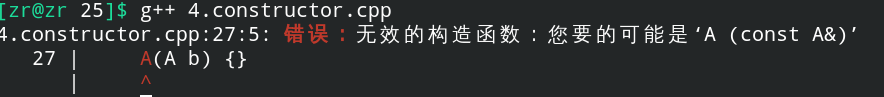

# 构造函数与析构函数

## 一、构造函数与析构函数

构造函数对应着类的对象的初始化方法，析构函数对应着类的对象的销毁方法，**构造函数和析构函数是系统自动调用的。**


### 1.构造函数的形式

| 构造函数形式                              | 使用方式                        |
| ----------------------------------------- | ------------------------------- |
| 默认构造函数                              | `People a;`                     |
| 有参构造函数，如 `People(string name)`    | `People a("name")`              |
| 拷贝构造函数，如`People(const People &a)` | 拷贝构造，`A b = a` ，与=不等价 |
| 转换构造函数                              | 只有一个参数的构造函数          |

拷贝构造函数在系统中有一个默认的实现，默认就是直接赋值。


### 2.析构函数的形式

| 析构函数的形式 | 使用方式 |
| -------------- | -------- |
| `~People() ;`  | 无       |


## 二、对象通过构造函数初始化(普通传参构造函数)

一个参数的构造函数初始化有两种形式：

+ `A a(10)`形式：传参形式给构造函数初始化。
+ `A a = 10`形式：等号赋值形式，**在定义对象的时候，等于号 = 匹配的是构造函数。**定义之后的 = 号根据是否重载了=运算符来决定操作，如果没有重载的话调用的还是构造函数。

```c++
#include<iostream>
#include<string>
#include<vector>
#include<queue>
#include<stack>
#include<algorithm>
using namespace std;

struct A {
    int x, y;
    A() {
        cout << "default constructor" << endl;
    }

    A(int n) {
        cout << "one int contructor" << endl;
        x = n, y = n;
    }

    void output() {
        cout << this->x << " " << this->y << endl;
    }

    ~A() {}
};

int main() {
    cout << "pre position" << endl;
    A a;
    A b = 6;
    A c(8);
    b.output();
    c.output();
    cout << "next position" << endl;
    return 0;
}
```


## 三、引用

**==引用不是变量，引用是传入参数的别名，实际使用的就是传入变量本身，不会发生拷贝操作==，而一般的传参会有一个拷贝的过程。**


## 四、拷贝构造函数

对于`A(A b){}`，如果使用这样子的构造函数编译是无法通过的：



原因如下：

如果我们使用上面的构造函数，当我们定义一个对象时：

```c++
A b(a);
// 等价于A b(A tmp = a);
```

其中，传参的过程中会引发新的拷贝：

```c++
A tmp(a)
```

进而又会引发新的拷贝，如此就**会造成无穷递归调用，因此，拷贝构造函数必须使用引用。**

拷贝构造函数的定义如下：

```c++
#include<iostream>
#include<string>
#include<vector>
#include<queue>
#include<stack>
#include<algorithm>
using namespace std;

struct A {
    int x, y;
    A() {
        cout << "default constructor" << endl;
    }

    A(int n) {
        cout << "one int contructor" << endl;
        x = n, y = n;
    }

    // 拷贝构造函数，参数是const A &b
    A(const A &b) {
        cout << "copy constructor" << endl;
        this->x = b.x, this->y = b.y;
    }

    void operator=(int n) {
        cout << "operator = " << endl;
        this->x = n, this->y = n;
    }

    void output() {
        cout << this->x << " " << this->y << endl;
    }

    ~A() {}
};

void func(int &x) {
    x += 10;
}

int main() {
    cout << "pre position" << endl;
    A a;
    A b = 6;
    A c(8);
    b = 10;
    A d(b);
    b.output();
    c.output();
    d.output();
    cout << "next position" << endl;
    return 0;
}
```


## 五、系统析构函数的执行顺序

**在C++中，不管是在堆区还是在栈区定义的对象(全局、局部)，其析构顺序必定是定义顺序的逆序，这是各个对象之间会存在相互的依赖关系，为了不破坏这种依赖关系，析构顺序需要按照构造顺序的逆序。**

