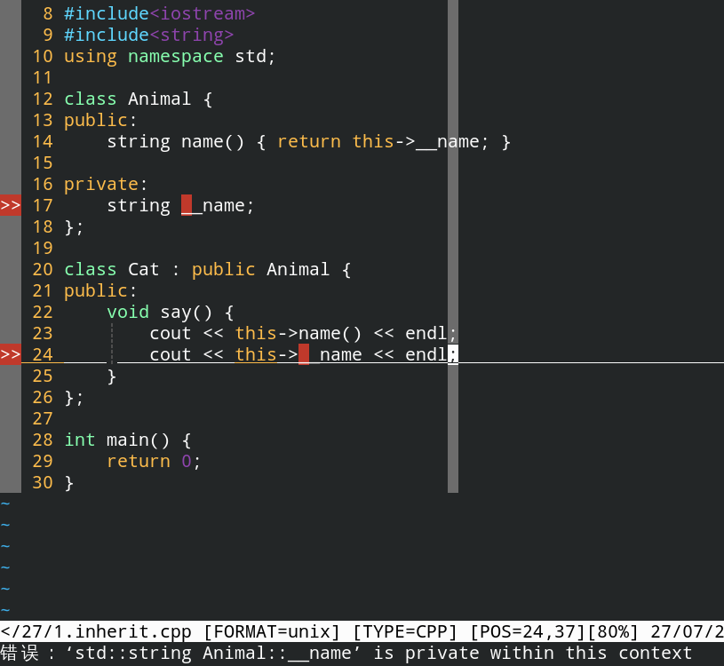
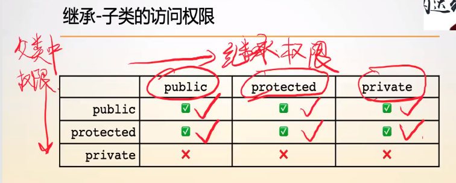
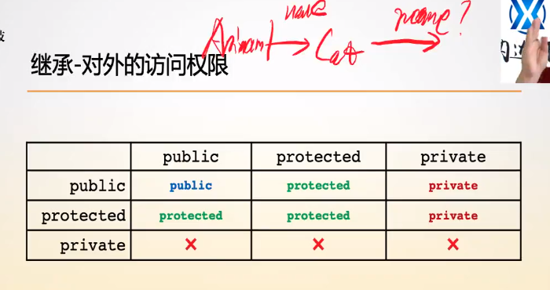

# 类的继承与继承权限

父类所有的属性与方法都会被包含到子类中，不管子类可不可以访问，**并且父类中的属性实际上是父类对象的，子类对象对父类中的成员属性与方法有相应的访问权限。**

**由于功能的有效性取决于数据的完整性，所以子类必须包含父类所有的属性与方法，因为属性、方法之间会有依赖关系。**

父类：专业称为 **基类**

子类：专业称为 **派生类**

> 补充：C++底层的编译逻辑，对于类，C++是先处理属性，方法的声明，之后才处理定义。由于类中的属性，方法，在不同的对象中不一样，所以这些属性、方法仅仅是声明，这些属性，方法是否存在只与对象是否存在有关，这些属性仅在对象存在的时候才占用存储空间，所以是声明。

**继承的语义信息：子类对象一定是父类对象，比如猫一定是动物。**


## 一、继承

在C++中，子类继承父类的格式为`class sub_class : public/protected/private father_class`，如下：

```c++
class Animal {
public:
    string name() { return this->__name; }

private:
    string __name;
};

class Cat : public Animal {
};
```

**子类确实会继承父类的所有属性和和方法，但是==父类中的private的属性与方法，虽然在子类中确实存在，但是不允许在子类中调用。==**




## 二、继承权限

继承权限影响的是外部对子类从父类继承的属性和方法的访问权限，这些属性和方法的访问权限只能小于等于原来的，即只能被压低，不能被提升。


### 1.不同继承权限下，子类的访问权限



**不论子类的继承权限如何，==子类总是可以访问父类的public和protected下的属性和方法，而父类的private属性和方法都无法访问。==**

**==继承权限不影响子类对父类的访问权限==，因为子类只能访问父类里的public和protected的属性与方法，private的一律访问不到。**


### 2.不同继承权限下，对外的访问权限

**==继承权限影响的是子类从父类继承过来的属性和方法对外的访问权限。==**



在protected继承权限下，子类的派生类可以访问子类继承自父类的public和protected属性，但是外界无法访问。

在private继承权限下，子类的派生类和外界都无法访问。

### 3. protected权限的意义

在父类中如果一个属性是protected，那么在子类中是可以访问到的，而private的话就是子类无法访问，而protected和private都不会让外界访问。

**==protected和private访问权限是为了区分父类相关属性和方法在子类中的访问范围。==**

如果让子类访问，不让外界访问，那么设置为protected，如果谁都不让访问，那么设置为private。