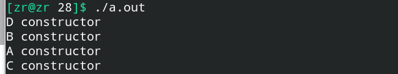
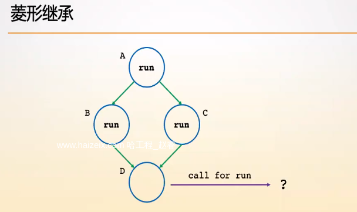
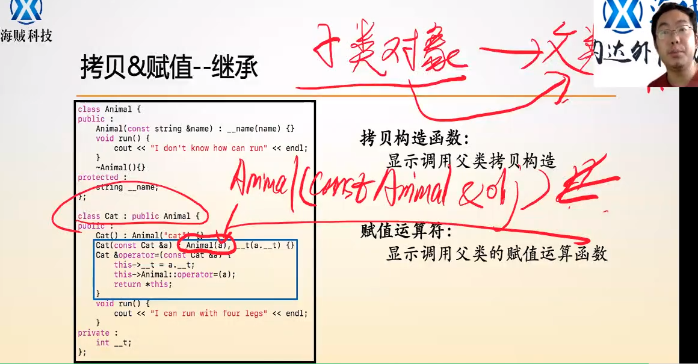

# 子类与父类的构造顺序和菱形继承问题

## 一、子类与父类的构造顺序

由于子类包含父类中的所有属性与方法，那么**==子类在构造的时，先是调用子类的构造函数，但是在初始化列表中会先构造父类，之后再继续构造子类==，我们可以显式在子类的构造函数的初始化列表里写出来，也可以直接使用默认的父类构造函数。**

> 一个类的对象的初始化过程在初始化列表执行结束就构造完成了，之后就是补充一些构造逻辑，一旦进入到构造逻辑，当前对象的所有属性，方法都可以使用了，意味着在构造逻辑之前，所有的属性和方法都初始化完成了。
>
> 在初始化列表中有：（1）显式初始化（2）隐式初始化。

**==子类对象的初始化过程中，子类先调用构造函数，但是在子类的初始化列表中，会调用父类的构造函数，因此是父类的构造函数先完成构造，之后才是子类的构造函数完成构造。==**

```c++
#include<iostream>
#include<string>
#include<vector>
#include<queue>
#include<stack>
using namespace std;

class D {
public:
    D() { cout << "D constructor" << endl; }
};

class A {
public:
    A() { cout << "A constructor" << endl; }
    A(int x, int y) { cout << "A constructor" << endl; }
};

class B {
public:
    B() { cout << "B constructor" << endl; }
};

class C : public D {
public:
    C() : a(1, 2), b() { cout << "C constructor" << endl; }

// 属性的初始化顺序是根据声明的顺序决定的，与初始化列表中的排列顺序无关。
private:
    B b;
    A a;
};

int main() {
    C c;
    return 0;
}
```

执行结果如下：



可以发现，**==类中属性的初始化顺序是根据声明的顺序决定的==，与初始化列表中的排列顺序无关。**


## 二、菱形继承

**在C++中是允许多重继承的，即一个类同时继承多个不同的类**，但是如果出现下面这种菱形继承：



就会出现问题：**如果我们在D类中调用run方法，我们不知道该调用A，B，C谁的run方法，==菱形继承会导致代码不可控，执行结果不可预期。==**

**为了避免菱形继承：==我们必须保证至多允许继承一个实体类，可以继承多个接口类(接口类是和抽象类精密联系的)==。**


## 三、继承下的拷贝构造函数与赋值运算符

### 1.拷贝构造函数



子类调用拷贝构造函数，在初始化列表中调用了父类的拷贝构造函数，**实际上这里是有着一个隐式类型转换的过程的，将子类的类型隐式转换成父类的类型。**


### 2.赋值运算符

就如上图，在子类中使用`this->FatherClass::operator=(a);`这种格式的就是**使用父类命名空间中的赋值运算符，其中自然也是存在隐式类型转换。**


