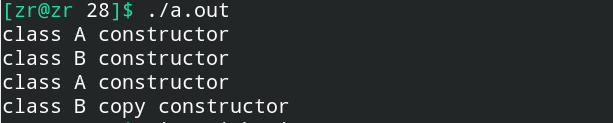
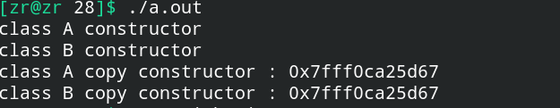

# 子类对象存储空间的分布情况

**==在子类对象的存储空间中，父类的数据都是在前面，存储完父类的数据之后才会存储子类的数据。==**

## 一、子类存储空间的分布情况

```c++
#include<iostream>
#include<string>
#include<vector>
using namespace std;

#define P_ADD(obj, a) {\
    cout << #obj"."#a" add = " << &(obj.a) << endl;\
} 

class Animal {
public:
    Animal(string name) : __name(name) {}
    string name() { return this->__name; }

    int x, y;
    string __name;
};

class Cat : public Animal {
public:
    Cat() : Animal("hello kitty") {}
    void say() {
        cout << "my name is " << this->name() << endl;
    }
    int z;
};


ostream &operator<<(ostream &out, const Cat &a) {
    out << "<class Cat> " << &a << endl;
    P_ADD(a, x);
    P_ADD(a, y);
    P_ADD(a, __name);
    P_ADD(a, z);
    return out;
}


int main() {
    Animal a("any");
    Cat c;
    c.say();
    cout << sizeof(a) << " " << sizeof(c) << endl;
    cout << c << endl;
    return 0;
}
```

这里代码的运行结果如下：


从这里可以看到，**在子类对象的存储空间中，父类的数据都是在前面，存储完父类的数据之后才会存储子类的数据。**


## 二、子类存储空间的分布对子类拷贝构造函数的支持

由于子类存储空间的开头部分都是父类对象的存储空间，所以**进行隐式类型转换是十分自然的，只需要构造子类对象开头父类对象对应的存储空间即可。**

**因此，==子类的对象可以绑定到父类的引用上，子类对象的地址可以绑定到父类的指针上，因为子类内存空间维护父类的信息的策略就是：子类开头部分存储父类的信息。这个就是隐式类型转换。==**

首先我们要明确，**子类中如果不显式调用父类的拷贝等构造，就会默认调用父类的默认构造函数。**例子如下：

```c++
#include<iostream>
#include<string>
#include<vector>
#include<queue>
using namespace std;

class A {
public:
    A() {
        cout << "class A constructor" << endl;
    }

    A(const A &a) {
        cout << "class A copy constructor" << endl;
    }
};

class B : public A {
public:
    B() { 
        cout << "class B constructor" << endl;
    }

    B(const B &b) {
        cout << "class B copy constructor" << endl;
    }
};

int main() {
    B b1;
    B b2(b1);
    return 0;
}
```

结果如图：



**子类中如果不显式调用父类的拷贝等构造，就会默认调用父类的默认构造函数**。

如果需要在子类中调用父类的拷贝构造函数，那么就需要显式地在初始化列表中写出：

```c++
#include<iostream>
#include<string>
#include<vector>
#include<queue>
using namespace std;

class A {
public:
    A() {
        cout << "class A constructor" << endl;
    }

    A(const A &a) {
        cout << "class A copy constructor : " << this << endl;
    }
};

class B : public A {
public:
    B() { 
        cout << "class B constructor" << endl;
    }

    B(const B &b) : A(b) {
        cout << "class B copy constructor : " << this << endl;
    }
};

int main() {
    B b1;
    B b2(b1);
    return 0;
}
```



**这段代码还体现了在子类的对象的内存空间中，构造的父类对象的存储空间就在子类对象存储空间的首部，剩下的是子类自己其他属性的存储空间。**

> 复习：大端小端问题：
>
> 小端：低位放在低地址。

