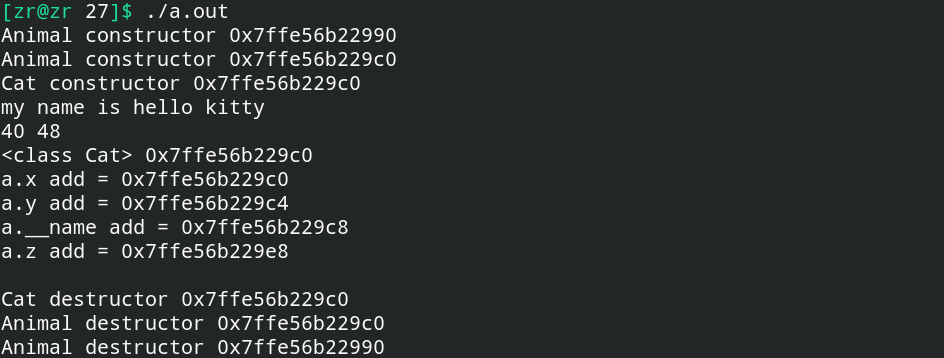

# 子类与父类的析构顺序

**由于在子类对象构造时，显示父类进行构造，然后子类再进行构造。**

**因此，在子类对象析构的时候，最先调用的是子类的析构函数，然后调用父类的析构函数。**

下面这段代码的运行结果展示了子类与父类的析构顺序。

```c++
#include<iostream>
#include<string>
#include<vector>
using namespace std;

#define P_ADD(obj, a) {\
    cout << #obj"."#a" add = " << &(obj.a) << endl;\
} 

class Animal {
public:
    Animal(string name) : __name(name) {
        cout << "Animal constructor " << this << endl;
    }
    string name() { return this->__name; }

    ~Animal() {
        cout << "Animal destructor " << this << endl;
    }

    int x, y;
    string __name;
};

class Cat : public Animal {
public:
    Cat() : Animal("hello kitty") {
        cout << "Cat constructor " << this << endl;
    }
    void say() {
        cout << "my name is " << this->name() << endl;
    }
    ~Cat() {
        cout << "Cat destructor " << this << endl;
    }
    int z;
};


ostream &operator<<(ostream &out, const Cat &a) {
    out << "<class Cat> " << &a << endl;
    P_ADD(a, x);
    P_ADD(a, y);
    P_ADD(a, __name);
    P_ADD(a, z);
    return out;
}


int main() {
    Animal a("any");
    Cat c;
    c.say();
    cout << sizeof(a) << " " << sizeof(c) << endl;
    cout << c << endl;
    return 0;
}
```

运行结果如图：



显然，在子类构造前先调用了父类的构造函数，子类要析构的时候，**根据先构造的后析构原则，先调用子类的析构函数，之后调用父类的析构函数。**