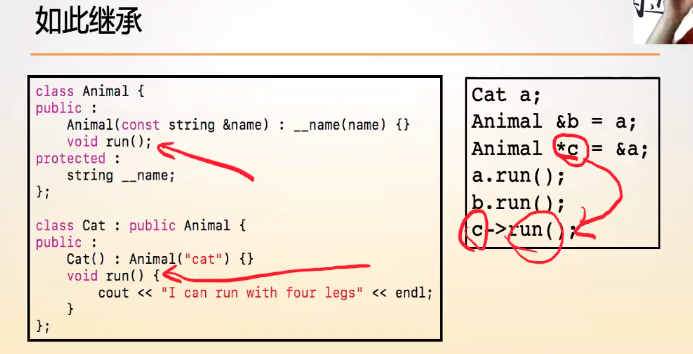
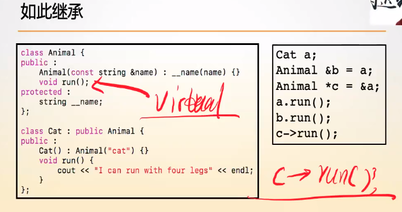
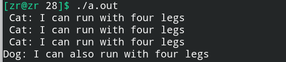
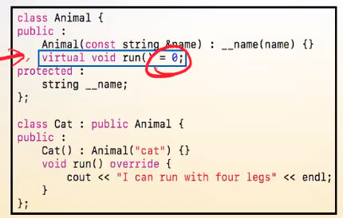

# 虚函数—多态的实现基础

**虚函数是C++实现多态最重要的基础，其意义在于可以让父类的引用或者指针访问到具体的子类对象的方法。**

**==为了保证子类的空间能够被正确回收，父类的析构函数一定要定义为虚函数！！！否则如果指针类型被转换了，那么析构就会不正确！！！==**


**只要有继承，父类的析构函数就一定要是虚函数！！！**


关于编译期状态和运行时状态的理解：

在编译期可以确定类型及相关信息即编译期状态的特点，**但是运行时状态有着在编译期无法确定的信息，这些信息需要额外的空间保存，使得在运行时调用相应的方法。**


## 一、虚函数—virtual关键字

**虚函数就是在父类中实现的一个虚拟方法，==这个是所有子类都共有一种方法，但是这个函数一般是在父类中不实现或者说其实现在子类中可以被替代的==。**

虚函数在子类中是可以被覆盖的。

**==虚函数是跟着对象走的，而普通成员方法是跟着类走的。==**

在子类中，覆盖虚函数时，我们需要使用override关键字，虽然不加也没有影响，但是**这样做可以避免函数名写错，将错误暴露在编译阶段，提高严谨性。**


### 1.普通成员方法跟着类走

之所以称普通成员方法是跟着类走的，其原因如下：


比方说这里有一个Animal类型的引用b，指针c，但是由于子类的内存空间分布与隐式类型转换，父类的引用可以绑定一个子类的对象，子类的地址可以赋给父类指针对象，**==此时通过引用和指针访问成员方法时，是根据此时引用和指针的类型来进行调用，实际上是父类中没有实现的成员方法，这就是普通成员方法跟着类走。==**


### 2.虚函数跟着对象走

**虚函数就是C++中实现多态的最关键手段。**

**==如果父类中的某个方法是虚函数，在子类中该方法自然而然，还是虚函数，不需要写virtual关键字。==**

以下图为例：



如果此时程序中有多个Animal类的派生类，而我问又要通过指针c去调用run()方法，**那么此时我们就不知道应该调用谁的run方法，==因为我们无法单从代码判断指针c指向的哪个类型的对象，这也就意味着我们无法判断调用run()的行为方式具体是什么，这依赖于实际的对象，而这就是多态的真正含义，即使类型被转换了，调用还是具体对象自己的方法。==**

下面代码和执行结果可以体现出多态的含义：

```c++
#include<iostream>
#include<string>
using namespace std;

class Animal {
public:
    Animal(const string &name) : __name(name) {}
    virtual void run() {
        cout << "I don't know how can run" << endl;
    }
    ~Animal() {}

private:
    string __name;
};

class Cat : public Animal {
public:
    Cat() : Animal("cat") {}
    // override关键字，但是没有override关键字照样可以在子类中覆盖父类中的虚函数，引入override关键字就是为了让不匹配的虚函数名暴露出来，将运行时的错误暴露在编译期。
    void run() override {
        cout << " Cat: I can run with four legs" << endl;
    }
};

class Dog : public Animal {
public:
    Dog() : Animal("dog") {}
    void run() override {
        cout << "Dog: I can also run with four legs" << endl;
    }
};

int main() {
    Cat a;
    Dog d;
    Animal &b = a;
    a.run();
    b.run();
    Animal *c = &a;
    c->run();
    c = &d;
    c->run();
    return 0;
}
```

运行结果为：



可以看出来，**即使类型被转换了，调用的方法还是实际对象的方法，即虚函数跟着对象走。**


## 二、纯虚函数

首先，**==纯虚函数是父类中不可能有方法实现的函数==，但是子类中必须实现的方法**，如图：



**==如果父类中有方法被声明为纯虚函数，那么子类中就必须实现这个方法==，这就类似于接口了。**

这就引到了接口类了，**==接口类中的方法是子类必须要实现的方法。==**

**对于需要子类强制实现的方法，声明成纯虚函数的形式。**


纯虚函数的语义：子类一定会有这个方法的定义，而父类没有。

纯虚函数的应用场景：定义接口


## 三、抽象类

**拥有纯虚函数的类称之为抽象类。**

由于纯虚函数是不可能有方法实现的函数，而一个对象是绝对不可以有方法没有实现，**这就意味着拥有纯虚函数的类是不可能产生对象的，即==抽象类不可能生成对象==。**

**有了抽象类之后，可以使得我们的代码更严禁，跟符合逻辑思维。**

**==很多时候，抽象类也被称为接口类。==**纯虚函数都被称为接口方法。


