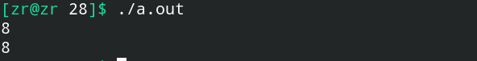
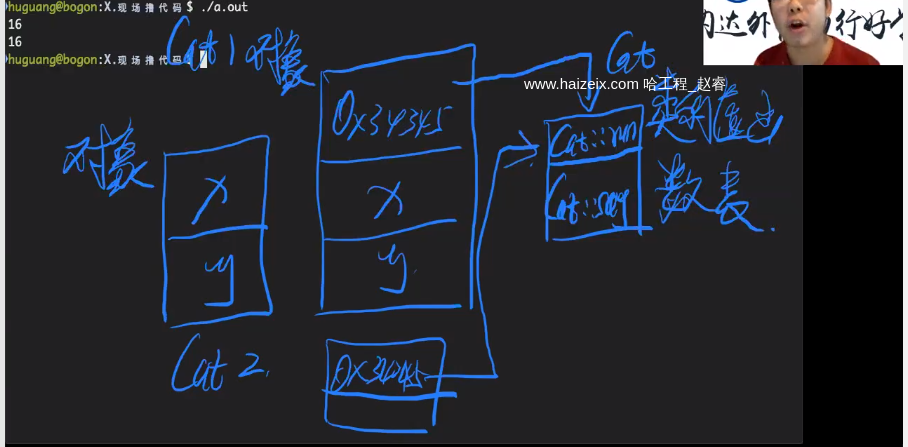
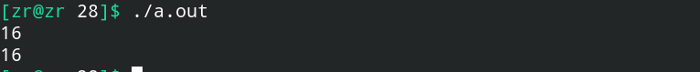
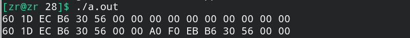
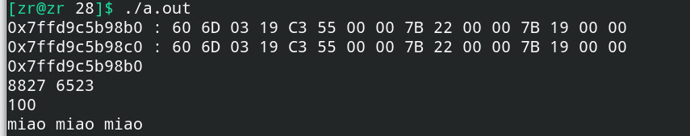

# 虚函数表

虚函数表是C++中用来管理虚函数的非常重要的部分。

## 一、虚函数表存在的证明

### 1.不带虚函数的基类与派生类的占用空间大小

```c++
#include<iostream>
#include<string>
#include<vector>
using namespace std;

class Animal {
public:
    Animal() = default;
    void say() { 
        cout << "I don't know how to say" << endl; 
    }

private:
    int x, y;
};

class Cat : public Animal {
public:
    Cat() = default;
    void say() {
        cout << "miao miao miao" << endl;
    }
};

int main() {
    cout << sizeof(Animal) << endl;
    cout << sizeof(Cat) << endl;
    return 0;
}
```

输出结果：




### 2.增加一个和多个虚函数后基类与派生类占用空间的大小

结果是增加了8个字节，不论增加的虚函数个数。因此可以分析得到：**==增加一个和多个虚函数之后基类与派生类增加的空间大小都是一样的，而这个增加的空间实际上就是对应虚函数表的首地址。==** 

**换言之，如果一个类具有虚函数，那么对象中就会==在头部多开辟一片空间==存储对应的==类的虚函数表==的==地址==。**这张虚函数表是当前类的所有对象共享的，即**当前类的不同对象的首部的存的虚函数表的地址指向的是同一张虚函数表**。



**==每一张虚函数表是以类为粒度来存储的。==**

这里只举出增加多个虚函数后的结果：

```c++
#include<iostream>
#include<string>
#include<vector>
using namespace std;

class Animal {
public:
    Animal() = default;
    virtual void say() { 
        cout << "I don't know how to say" << endl; 
    }

    virtual void run() {
        cout << "I don't know how to run" << endl;
    }

private:
    int x, y;
};

class Cat : public Animal {
public:
    Cat() = default;
    void say() override {
        cout << "miao miao miao" << endl;
    }

    void run() override {
        cout << "I can run with four legs" << endl;
    }
};

int main() {
    cout << sizeof(Animal) << endl;
    cout << sizeof(Cat) << endl;
    return 0;
}
```




## 二、同一个类不同对象共享类的虚函数表的证明

通过下面的代码，可以得到同一个类不同对象共享类的虚函数表的证明：

```c++
#include<iostream>
#include<string>
#include<vector>
using namespace std;

class Animal {
public:
    Animal() = default;
    virtual void say() { 
        cout << "I don't know how to say" << endl; 
    }

    virtual void run() {
        cout << "I don't know how to run" << endl;
    }

private:
    int x, y;
};

class Cat : public Animal {
public:
    Cat() = default;
    void say() override {
        cout << "miao miao miao" << endl;
    }

    void run() override {
        cout << "I can run with four legs" << endl;
    }
};

void output_raw_data(void *q, int n) {
    // 注意：一定要使用unsigned char *
    unsigned char *p = (unsigned char *) q;
    for (int i = 0; i < n; i++) {
        printf("%02X ", p[i]);
    }
    printf("\n");
    return ;
}

int main() {
    Cat a, b;
    output_raw_data(&a, sizeof(a));
    output_raw_data(&b, sizeof(b));
    return 0;
}
```

实际执行结果图：



可以发现，同一个类的两个不同对象的前8个字节内容相同，实际上指向的都是类的虚函数表，**而这实际上就是virtual关键字实现虚函数实现多态可以保证虚函数随着对象走的原因，因为==即使能够进行隐式类型转换，但是前8个字节里存的是真正类的虚函数表，调用相关的虚函数实际上就是对真正的对象进行操作。==**


## 三、验证虚函数表中存储的就是对应的虚函数及验证this指针的工作原理

从C语言的角度，使用函数指针来验证虚函数表中存储的就是相应的虚函数。

**在这段过程中，可以证明，==在C++的类中，this指针实际上是一个隐藏参数，类中所有的方法，实际上都会有this指针作为隐藏参数传入，这个this指针是作为函数的第一位参数传入的。==因此，所有的成员函数都可以使用this指针，而类外的函数无法使用this指针。**


```c++
#include<iostream>
#include<string>
#include<vector>
using namespace std;

class Animal {
public:
    Animal() {
        this->x = 8827, this->y = 6523; 
    }

    virtual void say(int x) { 
        cout << "I don't know how to say" << endl; 
    }

    virtual void run() {
        cout << "I don't know how to run" << endl;
    }

protected:
    int x, y;
};

class Cat : public Animal {
public:
    Cat() = default;
    void say(int n) override {
        cout << this << endl;
        cout << this->x << " " << this->y << endl;
        cout << n << endl;
        cout << "miao miao miao" << endl;
    }

    void run() override {
        cout << "I can run with four legs" << endl;
    }
};

void output_raw_data(void *q, int n) {
    unsigned char *p = (unsigned char *) q;
    printf("%p : ", p);
    for (int i = 0; i < n; i++) {
        printf("%02X ", p[i]);
    }
    printf("\n");
    return ;
}

// 因为在类中，this指针是作为类中方法的隐藏的第一个参数的，如果我们要通过C语言来调用对应的函数的话，就需要传入this指针对应的地址。
typedef void (*func)(void *, int x);

int main() {
    Cat a, b;
    output_raw_data(&a, sizeof(a));
    output_raw_data(&b, sizeof(b));
    ((func **)(&a))[0][0](&a, 100);
    return 0;
}
```

结果如下图所示：

