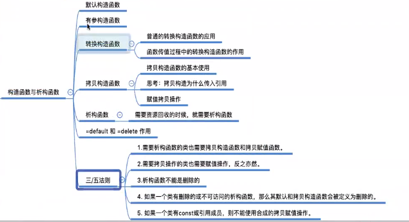
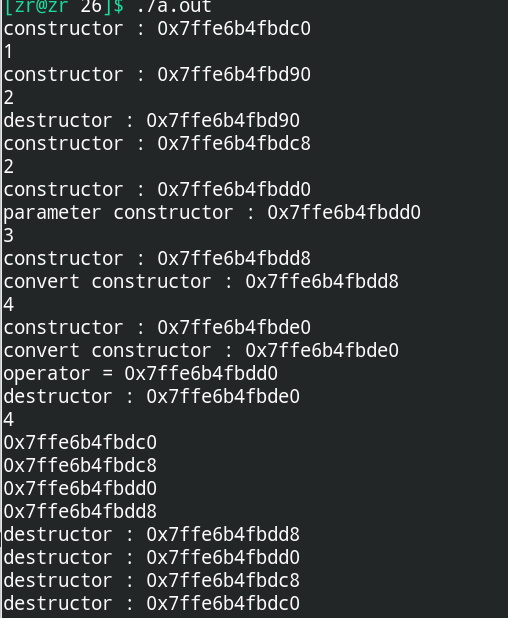

# 类型转换构造函数与赋值运算符的执行过程

## 一、类型转换构造函数

在有参构造函数中的**只有一个参数的构造函数被称为类型转换构造函数。**



```c++
#include<iostream>
#include<string>
#include<vector>
#include<queue>
#include<stack>
#include<algorithm>
using namespace std;

class BigInt {
public:
    BigInt() {}
    // 转换构造函数在传参的时候是可以进行自动类型转换
    BigInt(int x) {
        num.push_back(x);
        process_digit();
    }
    // 友元方法
    friend ostream &operator<<(ostream &out, const BigInt &a);

private:
    vector<int> num;
    void process_digit() {
        for (int i = 0; i < num.size(); i++) {
            if (num[i] < 10) continue;
            if (i + 1 == num.size()) num.push_back(0);
            num[i + 1] = num[i] / 10;
            num[i] %= 10;
        }
    }
};

// 重载对于大整数的运算符
ostream &operator<<(ostream &out, const BigInt &a) {
    for (int i = a.num.size() - 1; i >= 0; i--) out << a.num[i];
    return out;
}

void func(BigInt a) {
    cout << "func : " << a << endl;
}

int main() {
    BigInt a;
    // 普通的转换构造函数，仅仅在对象构造的过程中起作用
    a = 1234;
    cout << a << endl;
    // 函数传值过程中的转换构造函数的使用
    func(5678);
    return 0;
}
```


## 二、赋值运算符的执行过程

在C++的新版本中，赋值运算符的执行过程(**不是定义对象的拷贝构造**)是：

+ **首先对右侧变量调用类型转换构造函数，生成一个中间对象变量**
+ **之后调用重载或者默认的赋值运算符进行赋值，就是将中间对象变量赋值给左侧(这个不是在定义阶段的！！！)**
+ **中间对象变量析构**

```c++
#include<iostream>
#include<string>
#include<vector>
#include<queue>
#include<stack>
#include<algorithm>
using namespace std;

class Point {
public:
    Point() {
        cout << "constructor : " << this << endl;
        Point::total_cnt += 1;
    }

    Point(const Point &b) : Point() {
        cout << "copy constructor : " << this << endl;
        this->x = b.x;
        this->y = b.y;
    }

    Point(double z) : Point() {
        cout << "convert constructor : " << this << endl;
        this->x = 99, this->y = 99;
    }

    Point(int x, int y) : Point() {
        cout << "parameter constructor : " << this << endl;
        this->x = x;
        this->y = y;
    }

    ~Point() {
        cout << "destructor : " << this << endl;
        Point::total_cnt -= 1;
    }

    void operator=(const Point &b) {
        cout << "operator = " << this << endl;
        this->x = b.x;
        this->y = b.y;
    }

    static int T() { return Point::total_cnt; }

private:
    int x, y;
    static int total_cnt;
};

int Point::total_cnt = 0;

void test() {
    Point a;
    cout << Point::T() << endl;
    return ;
}

int main() {
    Point a;
    cout << a.T() << endl;
    test();
    Point b;
    cout << b.T() << endl;
    Point c(2, 3);
    cout << c.T() << endl;
    Point d(3.14);
    cout << d.T() << endl;
    c = 5.6;
    cout << c.T() << endl;
    cout << &a << endl;
    cout << &b << endl;
    cout << &c << endl;
    cout << &d << endl;
    return 0;
}
```

上面这段代码的执行结果如下，体现的就是赋值运算的执行过程：


