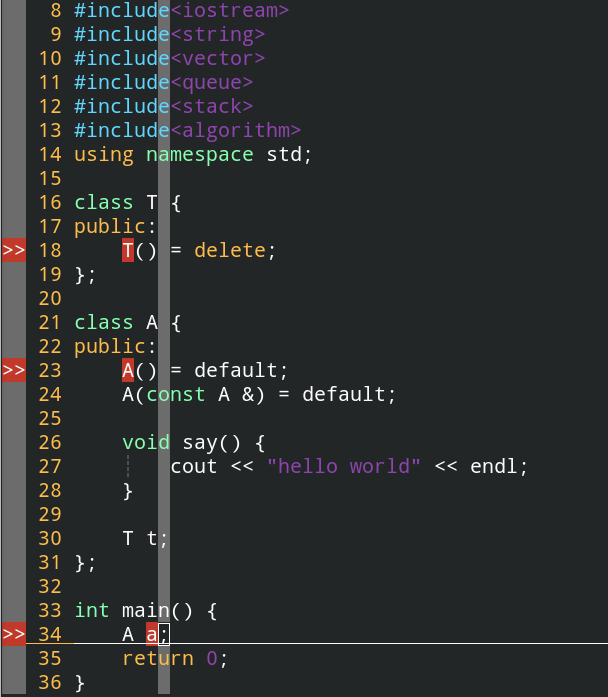
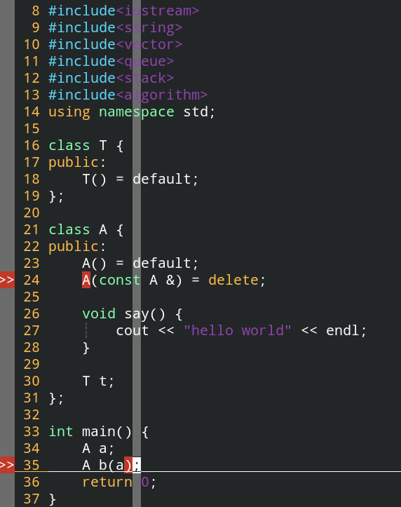

# 构造函数的default与delete关键字的作用

**==delete与default关键字的作用在于显式性地写出对各种构造函数的需求与限定等，即使是默认的，也要显式地用default表示出来==**。这样易于维护代码。

## 一、构造函数的default关键字的作用

default关键字定义了一种构造函数是采用默认实现的，使用方法如下：

```c++
A() = default;
A(const A &) = default;
```

**默认构造函数的默认行为：**

**==一个对象的默认构造函数会先调用相关成员的构造函数。==**



这里由于class T的默认构造函数被delete禁止了，所以在class A的构造函数进行t的初始化的时候会报错，**==delete与default关键字的作用在于显式性地写出对各种构造函数的需求与限定等，即使是默认的，也要显式地用default表示出来==**


## 二、delete关键字—禁止一个类型的构造函数

比如如果我们要禁止一个类的拷贝构造函数，就可以使用delete关键字进行声明，这样就会在编译时进行报错，从而保证工程开发的准确性。



如上图所示，在类中显示使用delete关键字禁止某种构造函数，这样就可以保证避免非法操作。