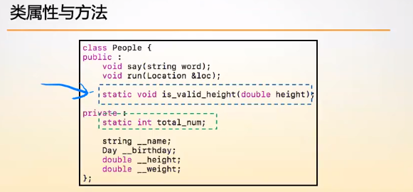
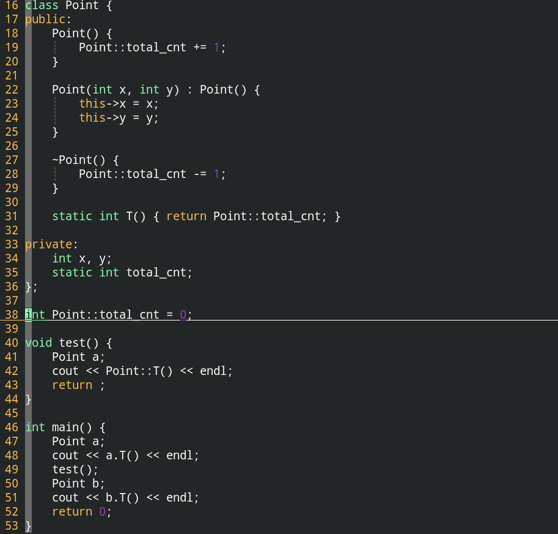

# 成员属性与成员方法、类属性与类方法

## 一、成员属性与成员方法

**成员属性是每个对象都得存一份的属性，可以通过this指针访问的那种，成员方法是每个对象都得存一份的方法。**

不同对象的成员属性之间是互不影响的，在**成员方法中可以访问this指针，而this指针指的是对象的地址**。


## 二、类属性与类方法

**在属性与方法之前加上关键字static，就可以得到类属性和类方法。**



**类属性和类方法可以看作是类中的静态的属性与方法。**

**==静态方法是访问不到this指针的，因为类方法这种静态方法与对象没有关系。==**

**类属性在类中仅仅是声明，我们还需要在外面给出类属性的定义。**

类属性与类方法主要是用于对类的整体情况的一个把控。

**访问类属性与类方法的途径：**

+ **==通过对象访问类属性与类方法==**

+ 在C++中，类名也是一个命名空间，因此可以**==通过类名作为命名空间来访问类属性与方法。==**

  **成员属性与成员方法是不能通过命名空间访问的，因为没有对象的话就没有成员属性与成员方法。**

类属性与类方法的访问控制权限和成员属性和成员方法一致。

> 编码规范：**==成员属性必须是私有的，绝对不能暴露在外面，不过可以增加获取与修改成员属性的方法。==**



**类属性在类中仅仅是声明，我们还需要在外面给出类属性的定义。**


## 三、构造函数与析构函数成对处理隐含的BUG

**在构造函数中+1，析构函数中减1，是有bug的，这是因为类型转换构造函数的作用阶段是不限于定义阶段的，所以才需要使用类属性与类方法。**


## 四、const类型方法

const类型的变量意味着这个变量不允许修改。

**const类型方法是说明在这个方法内部不去修改任何成员属性的值。**

const类型的方法目标就是为了将运行时的bug转换成编译时的bug。

```c++
string &name() const;
```

**==const类型的对象只能调用const类型的方法。==**

