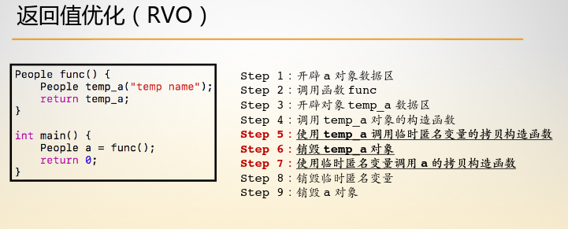
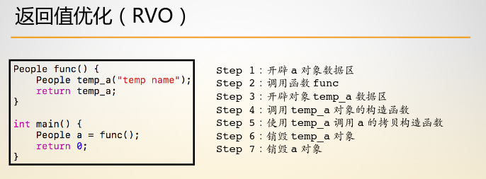
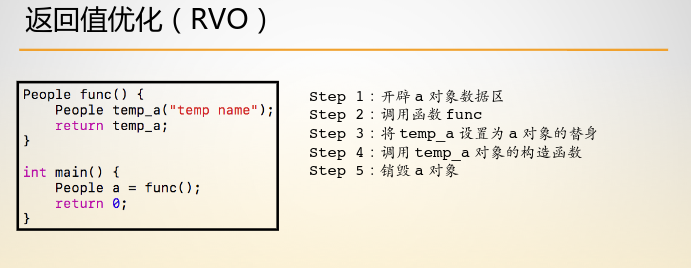

# 返回值优化(RTO)

## 一、对象的初始化过程

1. 开辟对象数据区
2. 匹配构造函数
3. 使用对应构造函数完成构造


## 二、返回值的相关构造过程

### 1.阶段1：两次拷贝构造

 


### 2.阶段2：一次拷贝构造




### 3.阶段3：无拷贝构造



在无拷贝构造的返回值优化中，函数中的可以看作是a变量的别名，上面三阶段最终的操作实际上都是落在a变量上的。

**无拷贝构造是GNU编译器默认的返回值优化。**

```c++
#include<iostream>
#include<string>
#include<vector>
#include<queue>
#include<stack>
#include<algorithm>
using namespace std;

class People {
public:
    People(string name) {
        cout << "parameter ocnstructor" << endl;
        this->name = name;
    }

    People(const People &a) {
        cout << "copy constructor" << endl;
        this->name = a.name;
    }

private:
    string name;
};

People func() {
    People temp_a("zhaorui");
    return temp_a;
}

int main() {
    People a = func();
    return 0;
}
```

如果要关闭返回值优化的话，可以在编译时增加选项：

```sh
g++ -fno-elide-constructors file_name
```

