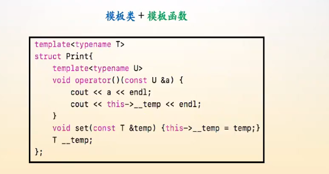

# 模板函数与模板类

**理解模板的关键：使用具体类型实例化的代码的执行逻辑。**

泛型编程的核心概念：将**任意类型**从**程序设计**中抽象出来。

**模板函数与模板类使用上的注意点与区别：**

==模板函数在实现的时候，参数列表中如果有参数，那么就会用到类型与参数。==

==模板类除了定义属性与成员函数时会用到类型与参数，其余的不会用到参数。==

```c++
// 模板函数，定义传参的时候会用到类型与参数
template<typename T>
T sum(T a) {
    return a;
}

template<typename T, typename ...ARGS>
T sum(T a, ARGS... args) {
    return a + sum(args...);
}

template<typename T, typename ...ARGS> class Test;
// 模板类，只有在定义成员函数的传参与定义属性的时候会用到类型与参数，其余一般就是类型
template<typename T, typename ...ARGS> 
class Test<T(ARGS...)> {
    public:
    T operator()(ARGS... args) {
        return add<T, ARGS...>(args...);
    }

    private:
    template<typename T1, typename U, typename ... US>
    T1 add(U a, US ...args) {
        return a + add<T1>(args...);
    }
    template<typename T1, typename U>
    T1 add(U a) {
        return a;
    }
};
```


## 一、泛型概念的理解

程序 = 算法 + 数据结构。

> 程序本身，即算法与数据结构实际上在本质上是与具体类型无关的，重要的是思想与对外表现，但是以前我们的算法与数据结构都会受到具体数据类型的限制。

泛型编程的思想体现在：

+ 数据结构：**能够存储任意类型**
+ 算法：**能够操作存储任意类型数据的数据结构**

**泛型编程就是==将任意类型从程序设计中抽象出来==。**


## 二、泛型编程

**泛型编程与面向过程编程与面向对象编程结合**后的结果：

|              | 泛型编程                           |
| ------------ | ---------------------------------- |
| 面向过程编程 | 用模板实现函数过程，**即模板函数** |
| 面向对象编程 | 用模板实现类，**即模板类**         |

在面向过程的编程范式中，我们将过程抽象成了函数;

在面向对象的编程范式中，我们将对象抽象成了类。

**泛型变成就是将面向过程编程，面向对象编程中的具体数据类型抽象出来，成为模板函数与模板类，这就是泛型编程范式。**

**模板类中依旧可以继续定义模板函数。**




## 三、模板函数

下面就是一个模板函数的实例，包含**模板的显式模板参数实例化与隐式的模板参数推导**两种使用方式：

```c++
template<typename T>
T add(T a, T b) {
    cout << "add function : " << sizeof(T) << endl; 
    return a + b;
}

int main() {
    // 隐式推导
    cout << add(2, 3) << endl;
    cout << add(2.3, 4.5) << endl;
    // 显式模板参数实例化
    cout << add<double>(2.3, 5) << endl;
    return 0;
}
```


## 四、模板类

下面是模板类的实例，**==模板类必须进行显示类型调用==。**

在类中，声明一个模板方法通常功能更加强大。

**此外，==在模板类中如果要将另一个模板函数定义为友元函数，那么需要将一个函数模板声明为友元函数，这个是根据逻辑得到的==。**

```c++
template<typename T>
T add(T a, T b) {
    cout << "add function : " << sizeof(T) << endl; 
    return a + b;
}

template<typename T>
class Array {
public:
    Array(int n) : n(n) {
        this->arr = new T[n];
    }

    T &operator[](int ind) {
        if (ind < 0 || ind >= n) return this->__end;
        return this->arr[ind];
    }

    // 友元函数模板
    template<typename U>
    friend ostream &operator<<(ostream &out, const Array<U> &a);

private:
    T *arr;
    T __end;
    int n;
};


template<typename T>
ostream &operator<<(ostream &out, const Array<T> &a) {
    out << "Class Array : ";
    for (int i = 0; i < a.n; i++) {
        out << a.arr[i] << " ";
    }
    return out;
}

int main() {
    cout << add(2, 3) << endl;
    cout << add(2.3, 4.5) << endl;
    cout << add<double>(2.3, 5) << endl;
    // 显示调用
    Array<int> a(10);
    Array<double> b(10);
    a[0] = 123;
    a[-123] = 456;
    for (int i = 0; i < 10; i++) {
        b[i] = (rand() % 100) / 100.0;
    }
    cout << a << endl;
    cout << b << endl;
    return 0;
}
```


## 五、非类型模板参数

对于函数模板与类模板，**模板参数并不局限于类型，普通值也可以作为模板参数，称之为非类型模板参数。**

**非类型模板参数的作用在于使得模板可以根据非类型模板参数的细节确定相应的操作。**

举例如下：

```c++
template<typename T, int VAL>
T addValue(T const& x)
{
    return x + VAL:
}
```

但是，非类型模板参数是有限制的，通常而言，**它们可以是整型（包括枚举值）或者指针。**

**==浮点数和类对象不允许作为非类型模板参数，也不可以使用全局指针作为模板参数。==**


## 五、查看模板函数与模板类实例化后的结果

通过`g++ -c filename`生成目标文件，之后**使用`nm -S`命令来查看目标文件的所有函数，类等的定义，可执行文件也是可以用nm命令查看。**

这样，我们就可以知道，在使用模板时，其实例的定义必须在编译阶段已经生成。

**模板的定义一般是实现在头文件中，此外宏作用在预编译阶段，而模板作用在编译阶段。**

在C++中**，==模板的定义到了链接阶段，编译器会自动合并重复的定义，但是普通函数的重定义还是会报错的。==**

