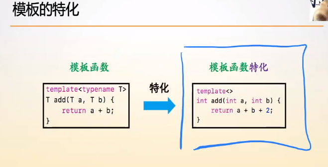
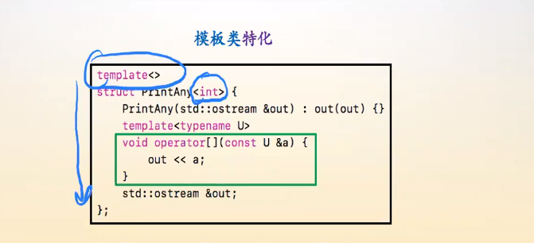
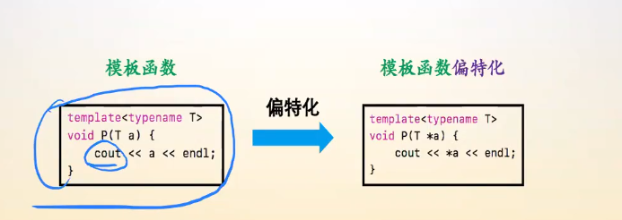

# 模板的特化与偏特化

## 一、模板的特化

模板特化的存在的意义在于：**模板的特化用于==解决具有特殊需求的类型的问题==。**

### 1.模板函数的特化

**模板函数的特化中，留下template关键字，但是<>中是空的，template必须要写！！！，这意味着这是一个模板函数，由于template后的<>是空的，因此是函数对于某一类型的特化版本。**

### 2.模板类的特化

**模板类，模板函数的特化实际上都是对那些具有特殊需求的类型的单独处理。**

模板类的特化中，template后的<>中也是空的，表明这是一个模板的特化。

**在模板的特化中，原本T的位置全都被替换成了具体的类型。**

## 二、模板的偏特化

**模板的特化意味着是针对了具体类型的处理，而偏特化则是针对某种统一性质或者情况的特殊处理，但是依旧是适用于所有类型的。**

### 1.模板函数的偏特化

 

以上图为例，如果是模板函数的话，不管是某种类型还是该类型的指针类型，函数的处理逻辑一样，但是在模板函数的偏特化中，可以指明这是对类型的指针类型的特殊处理。

**模板函数的偏特化就是针对一种统一性质或者情况下对类型的特殊处理，==模板的偏特化依旧是需要对任意类型成立的==。**

**==模板函数的偏特化还是一个模板函数==，只是可以看作==是原先模板函数的补充==，==是原先模板函数的偏特化版本==。**

> 特化就是百分之百确定了类型，偏特化的话一般是针对大部分类型可用就可以了。

**对于模板来说，类型是模板的传入参数。**