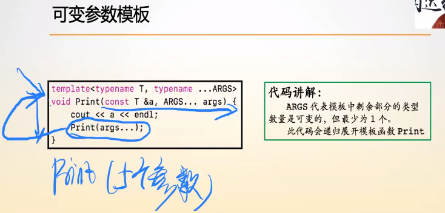
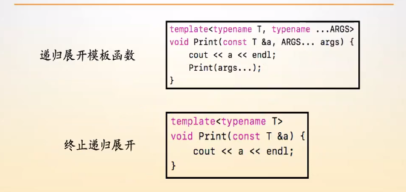
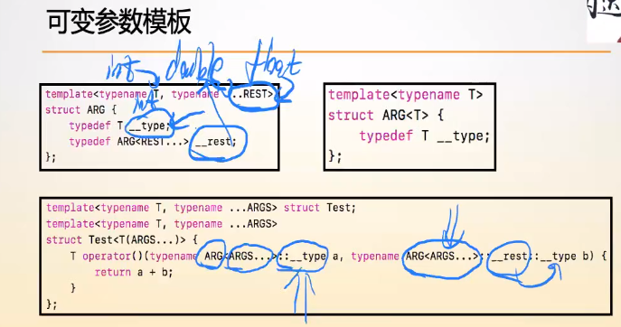

# 可变参数模板

可变参数模板，用于解决类型数量不确定的情况。

**==递归展开的终止模板一定要在变参模板之前写出来！！！==这就类似于面向过程编程范式中的，一个函数如果要调用另一个函数，那么另一个函数就应当在前面被实现或者声明。**


## 一、可变参数模板函数



 **变参模板中`typename ...ARGS`就表示模板中剩余部分的类型的数量是可变的，但是最少为1个。**



这里**==使用变参模板函数的偏特化版本来终止了的变参模板函数的递归展开==。**

**只有一个类型参数的模板可以看作是变参模板的偏特化版本。**

### 1.模板偏特化与递归方式展开参数包

可变参数模板函数的例子如下：

```c++
// 递归终止条件，偏特化的模板函数
template<typename T>
void print(const T a) {
    cout << a << endl;
    return ;
}
// 可变参数模板函数基本定义
template<typename T, typename ... ARGS>
void print(const T a, ARGS... args) {
    print(args...);
    return ;
}
```

可变参数模板函数的编写格式：

+ **递归终止条件，偏特化的模板函数（==变参模板函数的递归终止条件一定要在前面写出来！！！==）**
+ **可变参数模板函数的基本定义，其中存在递归调用**


## 二、可变参数模板类



**可变参数模板类也是类似于可变参数模板函数，采用递归的方式展开类型参数，==可变参数模板类的话就是类的递归展开==，当然，也是需要一个变参模板的偏特化版本作为递归终止条件。**

### 1.模板偏特化和递归方式来展开参数包

可变参数模板类的展开标准来说需要定义三个类：

+ **前向声明**;
+ **基本定义**;
+ **递归终止，即==偏特化的模板类==(在可变参数模板类中，递归终止是在基本定义后面的)**。

例子如下：

```c++
//前向声明
template<typename First, typename... Args>
struct Sum;

//基本定义
template<typename First, typename... Rest>
struct Sum<First, Rest...> : std::integral_constant<int, Sum<First>::value + Sum<Rest...>::value>
{
};

//递归终止
template<typename Last>
struct Sum<Last> : std::integral_constant<int, sizeof(Last)>
{
};
sum<int,double,short>::value;//值为14
```

