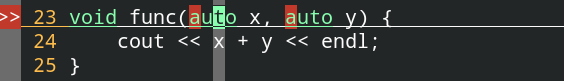

# auto与decltype关键字—自动类型推导

**==auto关键字必须用在定义变量的场合！！！因为auto需要根据定义的右侧的类型进行自动类型推导。==**


## 一、auto关键字—自动类型推导

**在C语言中，auto关键字表明具有自动存储期的变量。**

**在C++中auto关键字就是用来进行自动类型推导的：**

```c++
auto a = 123;
cout << sizeof(a) << endl;
map<int, int> mp;
mp[789465] = 176523;
mp[4657] = 712;
mp[999] = 10000;
// 只能用于变量的定义，不能用于变量的声明，因为auto是根据定义右侧的类型在编译期推导左侧变量的类型
for (auto iter = mp.begin(); iter != mp.end(); iter++) {
    cout << iter->first << " "  << iter->second << endl;
}
// 访问容器内元素的另一种循环方法
for (auto &x : mp) {
    cout << x.first << " " << x.second << endl;
}
```


auto关键字不能使用的场合：

+ **不能作为函数参数。**

  

  **==auto关键字必须要用在定义变量的场合！！！==因此函数的参数是绝对不可以使用啊uto关键字的！！！因为函数的参数是无法在声明的时候给定义的。**

+ **不能作为模板参数**，即`template<typename T>`中的T在实际使用的时候不可以用auto。

+ **无法定义数组。**

+ **不能用于非静态的成员变量**。

auto可以用于静态成员变量，如下所示：

```c++
class A {
public:
    // 赋值一定要在类中进行
    static const auto x = 123;
};
```

如果是普通的单个变量的话，静态、动态变量都可以使用自动类型推导。