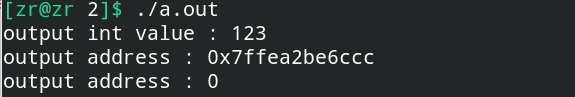

# nullptr关键字—C++的空指针

## 一、nullptr空指针与NULL的区别

**在C++中nullptr是严格表示空地址(0x0)**，而NULL本质上是一个整数0，只是我们将其看作地址。

**因此，nullptr与NULL的区别在于：==nullptr本质上是严格意义上的空地址0x0, 而NULL本质上是一个数字0,只是我们为NULL赋予了int 0与(void *) 0这两种含义，无法严格判断其类型，会造成编译器的混淆==**。

```c++
#include<iostream>
using namespace std;

int f(int x) {
    cout << "output int value : ";
    cout << x << endl;
    return 0;
}

int f(int *x) {
    cout << "output address : " ;
    cout << x << endl;
    return 0;
}

int main() {
    int n = 123, *p = &n;
    f(n);
    f(p);
    f(nullptr);
    return 0;
}
```

执行结果如下所示：



