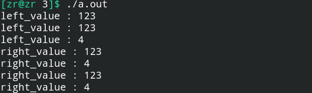

# 右值引用

## 一、基本概念

### 1.左值与右值

左值与右值的区分：**在下面的代码中是否可以==通过同样的变量，以单一的方式，访问到同样的结果==。如果可以，就是左值，否则就是右值。**

换句话说，**右值具有临时性。**

> 加法结果产生的临时值，都是右值。


### 2.左值引用与右值引用

左值引用&，右值引用&&，在函数传参中，左值优先绑定左值引用的，右值优先绑定右值引用的。

**表达式返回值是右值引用的，那么肯定就是右值了。**

**==即使函数的参数是右值引用，但是在这个函数体的内部这个参数都是一个左值引用，因为凡是有名字的东西，都不是右值。==**

但是不是意味着看到`T &&`就认为这一定是一个右值引用，在**模板中的引用折叠概念**就说了，如果`T`代表的是`U &`，那么它还是左值，因为`U &&&`因为引用折叠相当于`U &`。

```c++
#include<iostream>
#include<string>
#include<vector>
#include<queue>
#include<stack>
#include<algorithm>
using namespace std;
void f(int &x) {
    cout << "left value" << endl;
}

void f(int &&x) {
    cout << "right value" << endl;
}
 
int main() {
    int a = 123 + 456;
    int b = 1, c = 3;
    f(a); // 左值
    f(a++); // 右值
    f(++a); // 左值
    f(a + b); // 右值
    return 0;
}
```

**左值优先绑定左值引用，右值优先绑定右值引用。**

但是，**在有右值引用的函数内部，右值引用会被转成左值引用，**这样就无法保证右值引用一直都是作为右值引用被处理，因此，C++11开始**引入了forward与move机制，使得我们能够将左值引用转换成右值引用(==forward可以左右值互相转换， move强制将左值/左值引用转右值/右值引用==)。**

**==使用forward，move可以使得右值引用正确的向下传递。==**

```c++
#include<iostream>
#include<string>
#include<vector>
#include<queue>
#include<stack>
#include<algorithm>
using namespace std;

#define TEST(a, f) {\
    cout << #a << " : " << #f << " ";\
    f(a);\
}

void f2(int &x) {
    cout << "right value" << endl;
}

void f2(int &&x) {
    cout << "right value" << endl;
}

void f(int &x) {
    cout << "left value" << endl;
    TEST(x, f2);
}

void f(int &&x) {
    cout << "right value" << endl;
    // move强制将左值/左值引用转换成右值/右值引用
    TEST(move(x), f2);
    // forward指定向前传递的类型，forward<int &&>(x)
    TEST(forward<int &&>(x), f2);
}
 
int main() {
    int a = 123 + 456;
    int b = 1, c = 3;
    f(a);
    f(a++);
    f(++a);
    f(a + b);
    return 0;
}
```


## 二、forward与move

首先注意一点：一个左值后面不用时，左值引用转右值引用有意义，但是右值引用转左值引用一般是没有意义的。

### 1. forward关键字

std::forward的作用在于**将某一引用类型参数转换成指定的引用类型（==由于模板的引用折叠，如果直接指定无引用的类型实际上就是指定转换成为右值引用==）：**

```c++
#include<iostream>
using namespace std;

void func(int &x) {
    cout << "left_value : " << x << endl;
}

void func(int &&x) {
    cout << "right_value : " << x << endl;
}

int main() {
    int n = 123, &x = n;
    int &&y = 4;
    func(x);
    func(forward<int &>(x));
    func(forward<int &>(y));
    func(forward<int &&>(x));
    func(forward<int &&>(y));
    func(forward<int>(x));
    func(forward<int>(y));
    return 0;
}
```

执行结果如下：




**==在模板中，函数参数用`T &&x`这样可以保证参数的类型在引用折叠之后是不变的，forward的意思是，参数推导出来是左值引用就当左值引用，参数推导出来是右值引用就当右值引用==**，这种做法是**使用`forward<T>`的时候类型参数写成T**来实现的。一般来说这种用法是配合模板使用的。

```c++
void Print(int &x) {
    cout << "x is int &" << endl;
}

void Print(int &&x) {
    cout << "x is int &&" << endl;
}

template<typename T>
void CallPrint(T &&x) {
    // forward是根据X的类型进行传递，只有在参数绑定到一个右值上的时候，它才转换它的参数到一个右值
    Print(std::forward<T>(x))
}
```


### 2. move关键字

**==move在传递左值引用类型的对象的同时，用来”声称“一个左值引用指向的对象已经再也不需要使用了，因此返回该对象的一个右值引用==**，可以用来传递给一些接受右值引用的函数，特别是右值引用构造函数(移动构造函数)。


## 三、move constructor 移动构造

