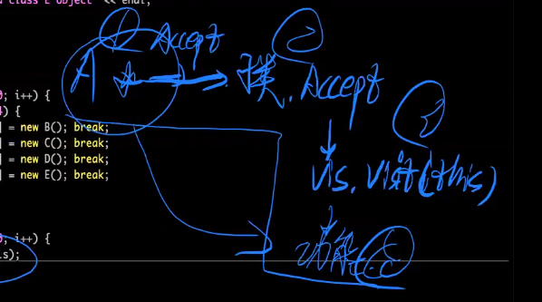

# 访问者模式

## 一、访问者模式的功能与意义

**访问者模式是为了实现==根据不同类型作功能映射的需求==，从而将运行期的错误尽量暴露在编译阶段。**

因为，如果不使用访问者模式，我问就需要使用比如**`dynamic_cast`来进行类型判断，判断次数多，效率低，并且可能因为忘记补充新情况而导致可以运行，但是存在致命性的BUG。**

**访问者模式的最显著效果**：==我们增加了一个派生类，但是忘记增加了根据新增派生类所映射的功能时，编译器就会报错。==


## 二、访问者接口类

**==访问者接口类在基类中声明，声明对不同类型的处理方法，到时侯在真正实现功能的访问者派生类中实现对于不同派生类的处理方法。==**

**==基类中还需要声明接受访问者指针的纯虚函数==，这实际上就是一个让访问者类起作用，实现指定功能的。**

**正是因为在基类中声明了访问者接口类，所以才能够保证到时侯==如果有添加的派生类，只需要在访问者接口类中添加了这个派生类的相关虚函数，能够确保所有进行功能映射模块必须实现该派生类的功能映射函数，否则就会报错==**，这样就使得运行期的错误暴露在编译期了。

使用例子如下：

```c++
class B;
class C;
class D;
class E;

class A {
public:
    // 访问者接口类，所有函数都是纯虚函数，后面继承的子类需要实现这些纯虚函数
    // 访问者接口类的子类就是用来实现实际功能的，根据传入的对象类型执行相应的功能
    class IVisitor {
    public:
        // 根据派生类的类型定义一系列纯虚函数，能够避免使用if-else与dynamic_cast带来的时间消耗
        virtual void visit(B *) = 0;
        virtual void visit(C *) = 0;
        virtual void visit(D *) = 0;
        virtual void visit(E *) = 0;
    };
    // 基类中声明一个接收访问者类的纯虚函数
    virtual void Accept(IVisitor *) = 0;
    virtual ~A() {}
};

class B : public A {
public:
    // 子类中实现虚函数，接收访问者，
    virtual void Accept(IVisitor *vis) override {
        // 访问者对象根据调用对象的类型调用相应函数
        vis->visit(this);
    };
};

class C : public A {
public:
    virtual void Accept(IVisitor *vis) override {
        vis->visit(this);
    };
};

class D : public A {
public:
    virtual void Accept(IVisitor *vis) override {
        vis->visit(this);
    };
};

class E : public A {
public:
    virtual void Accept(IVisitor *vis) override {
        vis->visit(this);
    };
};

// 访问者接口类的派生类，真正的访问者类，根据传入的对象类型执行相应的功能
class OutputVisitor : public A::IVisitor {
public:
    virtual void visit(B *obj) override {
        cout << "this is a class B object" << endl;
    };
    virtual void visit(C *obj) override {
        cout << "this is a class C object" << endl;
    };
    virtual void visit(D *obj) override {
        cout << "this is a class D object" << endl;
    };
    virtual void visit(E *obj) override {
        cout << "this is a class E object" << endl; 
    };
};
```


## 三、访问者模式的流程

访问者模式实现功能的4步实际工作流程如下：



 **好处就在于访问者模式的效率不会因为派生类数量的增加而下降，程序设计也会更加清晰，针对于一套映射功能，是直接封装成一个访问者类的。**


